# Installation guide and Video Tutorial
A video walkthrough demonstrating the installation process of Agent Zero.
<iframe width="560" height="315" src="https://www.youtube.com/embed/8H7mFsvxKYQ?si=vmGqb--6vczI9gik" title="YouTube video player" frameborder="0" allow="accelerometer; autoplay; clipboard-write; encrypted-media; gyroscope; picture-in-picture; web-share" referrerpolicy="strict-origin-when-cross-origin" allowfullscreen></iframe>

The following guide provides comprehensive instructions for installing Agent Zero on various operating systems. Choose the section that corresponds to your OS:

## Windows

### Quick Start

1. **Install Anaconda or Miniconda:** Download and install the appropriate version for your system from [here](https://docs.anaconda.com/anaconda/install/). Miniconda is recommended for a minimal installation.
2. **Create an Environment:** Open Anaconda Navigator (or use the `conda` command), create an environment named `agent-zero`, and select Python 3.12.
3. **Install Docker Desktop:** Download and install Docker Desktop from [here](https://www.docker.com/products/docker-desktop/).
4. **Download Agent Zero:** Download the latest release zip from the [GitHub releases page](https://github.com/frdel/agent-zero/releases) and extract it.
5. **Configure API Keys:** Duplicate `example.env`, rename it to `.env`, and add your API keys.
6. **Install Requirements:** Activate your `agent-zero` environment, open a terminal in the Agent Zero directory, and run: `pip install -r requirements.txt`
7. **Run Agent Zero (Web UI):** Execute `python run_ui.py` in your terminal.
8. **Access the Web UI:** Open the URL displayed in your browser.

### Detailed Guide with Screenshots

Follow these detailed steps with accompanying screenshots:

#### 1. Install Conda (Miniconda)

Conda is a Python environment manager.  We'll use Miniconda.

1. Download Miniconda: Go to the [Miniconda download page](https://docs.anaconda.com/miniconda/#miniconda-latest-installer-links) and download the appropriate installer for Windows.

   

2. Run the Installer:  Follow the on-screen instructions, using the default settings.

   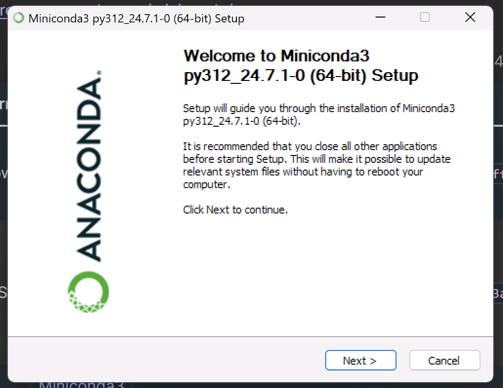
   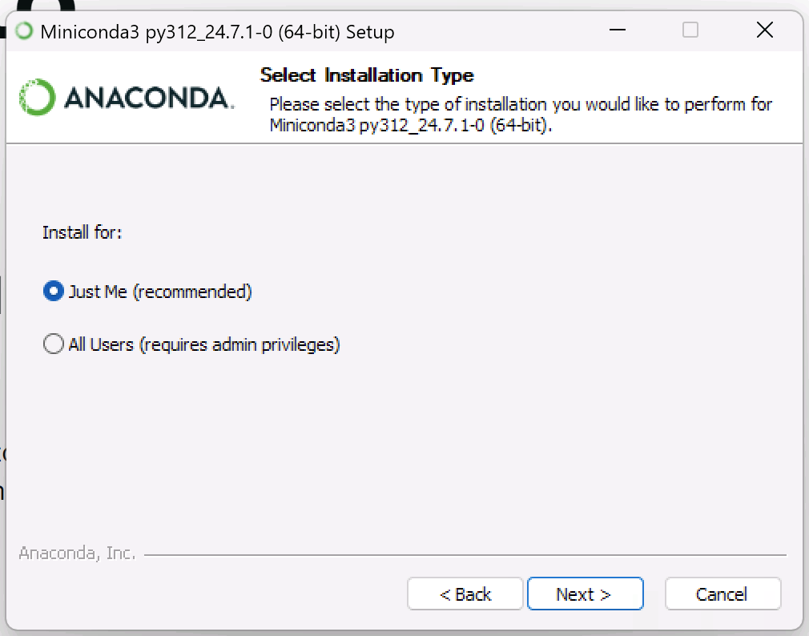
   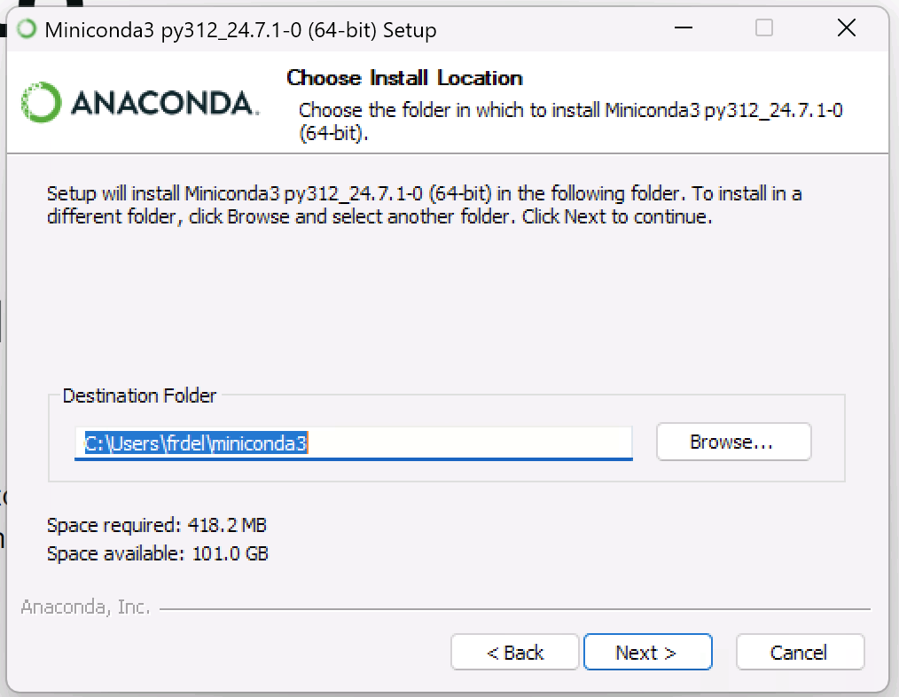
   


3. Verify Installation: Open the "Anaconda Powershell Prompt" and check the conda version: `conda --version`.

    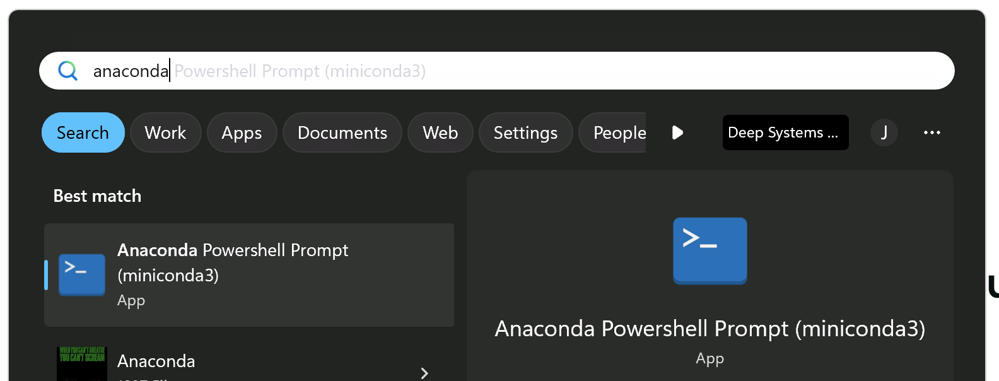

#### 2. Install Docker Desktop

Docker provides isolated environments for running applications.

1. Download Docker Desktop: Go to the [Docker Desktop download page](https://www.docker.com/products/docker-desktop/) and download the Windows installer.

   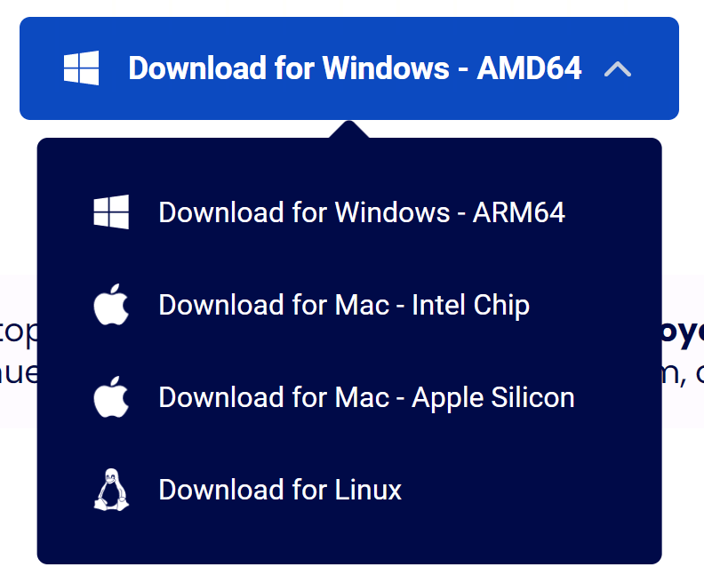

2. Run the Installer: Follow the on-screen prompts, accepting the default settings.

   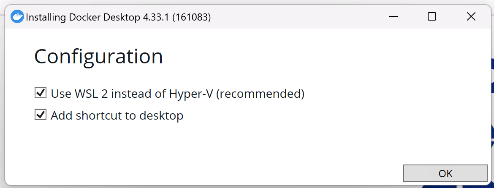
   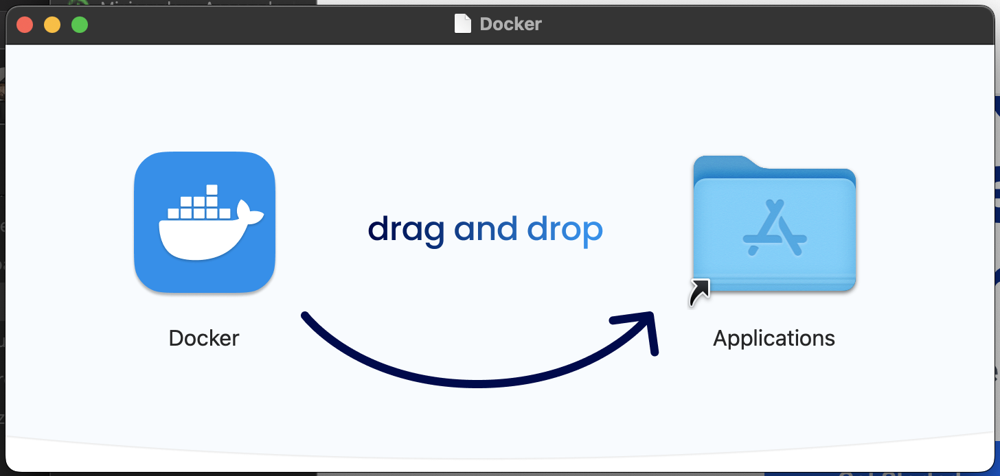


3. Verify Installation:  You should see the Docker Desktop application in your system tray.

    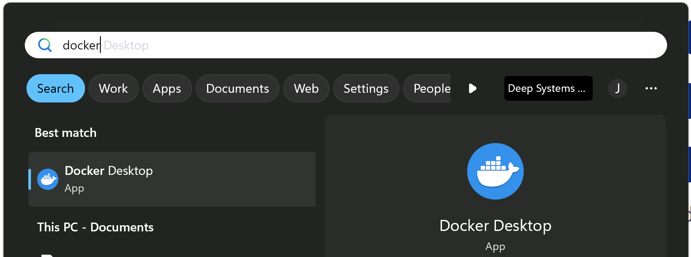

4. Create a Docker Hub Account: Sign in or create a free account within the Docker Desktop application. This is required for Agent Zero to pull the necessary Docker images.

#### 3. Download and Extract Agent Zero

1. Download the latest Agent Zero release from the [GitHub releases](https://github.com/frdel/agent-zero/releases) page.  Choose the "Source code (zip)" option.

    

2. Extract the zip file to a directory on your computer.

#### 4. Set Up the Conda Environment

1. Open Anaconda Powershell Prompt: Search for "Anaconda Powershell Prompt" in the Windows Start menu and open it.

2. Navigate to Agent Zero Directory: Use the `cd` command to navigate to the directory where you extracted Agent Zero.  For example: `cd C:\Users\YourUsername\Desktop\agent-zero`

    

3. Create Conda Environment: Run the following command to create a new conda environment named "a0": `conda create -n a0 python=3.12 -y`. The `-y` flag automatically confirms the installation.

4. Activate Conda Environment:  Run:  `conda activate a0`

    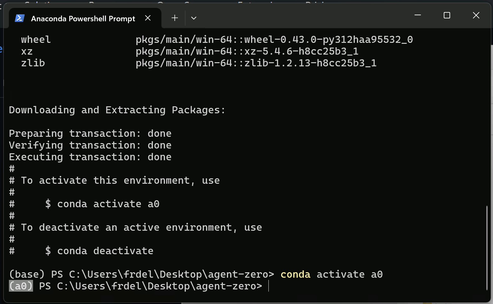

5. Install Requirements:  With the environment activated, run: `pip install -r requirements.txt`

     

#### 5. Configure Agent Zero

1. Configure API Keys: Locate the `example.env` file, copy it, and rename the copy to `.env`.  Open the `.env` file and add your API key for OpenAI (or other providers) after `API_KEY_OPENAI=`.

    

#### 6. Run Agent Zero

1. Ensure Docker Desktop is running.
2. In the Anaconda Powershell Prompt (with the "a0" environment activated and in the Agent Zero directory), run: `python run_ui.py`

    

3. Access the Web UI:  Open the URL displayed in your terminal.  The first time you run Agent Zero, it will download and initialize the Docker container, which may take some time.

    
    

## macOS

### Quick Start

1. **Install Miniconda:** Download the pkg installer from [here](https://docs.anaconda.com/miniconda/#miniconda-latest-installer-links) and follow the instructions.
2. **Install Docker Desktop:** Download the dmg image from [here](https://www.docker.com/products/docker-desktop/), drag the Docker application to your Applications folder, and create a Docker Hub account.
3. **Download Agent Zero:** Download the latest release zip from the [GitHub releases page](https://github.com/frdel/agent-zero/releases) and extract it.
4. **Open Terminal:** Navigate to the Agent Zero directory.
5. **Create Conda Environment:** Run: `conda create -n a0 python=3.12 -y`
6. **Activate Environment:** Run: `conda activate a0`
7. **Install Requirements:** Run: `pip install -r requirements.txt`
8. **Configure API Keys:** Create a `.env` file and add your keys.
9. **Run Agent Zero (Web UI):** Run: `python run_ui.py`
10. **Access the Web UI:** Open the displayed URL.

### Detailed Guide with Screenshots

Follow these detailed steps with accompanying screenshots:

#### 1. Install Conda (Miniconda)

Conda is a Python environment manager.  We'll use Miniconda.

1. Download Miniconda: Go to the [Miniconda download page](https://docs.anaconda.com/miniconda/#miniconda-latest-installer-links) and download the macOS pkg installer.

   

2. Run the Installer: Double-click the pkg file and follow the on-screen prompts, keeping the default settings.

3. Verify Installation: Open Terminal and type `conda --version`. You should see the installed conda version.

    

#### 2. Install Docker Desktop

Docker provides containerization for running applications in isolated environments.

1. Download Docker Desktop: Go to [Docker Desktop download page](https://www.docker.com/products/docker-desktop/) and download the macOS dmg image.

2. Install Docker Desktop: Open the dmg image and drag the Docker icon to the Applications folder.

    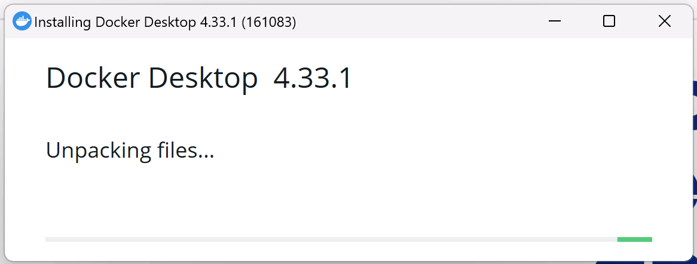

3. Verify Installation and Create Account: Open Docker Desktop (from Applications).  You'll be prompted to sign in or create a free Docker Hub account. Do so—this is necessary for Agent Zero to pull and manage Docker images.

    

4. **Important macOS Docker Configuration:** In Docker Desktop's preferences (Docker menu) go to Settings, navigate to "Advanced" and check "Allow the default Docker socket to be used (requires password)."  This allows Agent Zero to communicate with the Docker daemon.

    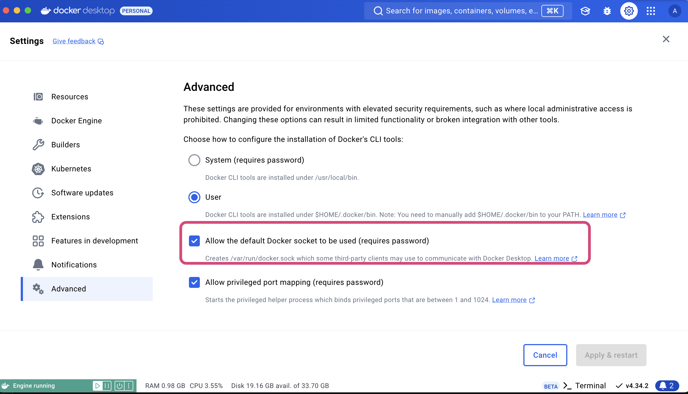

#### 3. Download and Extract Agent Zero

1. Download Agent Zero: Go to the [GitHub releases](https://github.com/frdel/agent-zero/releases) page and download the latest "Source code (zip)" release.

    

2. Extract Agent Zero: Double-click the downloaded zip file to extract its contents.

#### 4. Set up Conda Environment

1. Open Terminal:  Launch the Terminal application.
2. Navigate to Agent Zero Directory:  Use the `cd` command to navigate to the extracted Agent Zero folder.  For example: `cd /Users/YourUsername/Desktop/agent-zero`

    


3. Create and Activate Environment: Run the following commands to create and activate a conda environment named "a0" with Python 3.12:

   ```bash
   conda create -n a0 python=3.12 -y
   conda activate a0
   ```

    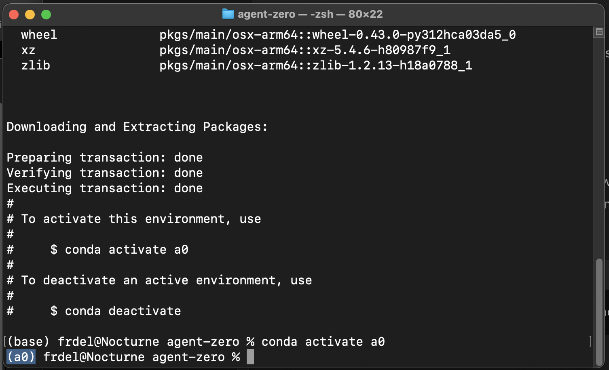

4. Install Requirements: While in the activated environment and Agent Zero directory, run: `pip install -r requirements.txt`

    

#### 5. Configure Agent Zero

1. Configure API Keys: Find the `example.env` file, copy and rename it to `.env`. Open `.env` and add your OpenAI API key (or other API keys) as needed.

    

#### 6. Run Agent Zero

1. Make sure Docker Desktop is running.
2. In your terminal (with the "a0" environment active and within the Agent Zero directory), run: `python run_ui.py`

    


3. Access the Web UI:  Open the URL displayed in your terminal. On first launch, Agent Zero will download the necessary Docker images, which can take a while.

 
 

## Linux

### Quick Start

1. **Install Python and Pip:** Use your distribution's package manager (e.g., `apt`, `yum`, `dnf`) to install Python 3.12 or higher and pip. On Debian/Ubuntu systems, you would typically use:
   ```bash
   sudo apt-get update
   sudo apt-get install python3.12 python3-pip
   ```
2. **Install Docker:** Install Docker Desktop or Docker CE using your distribution's package manager. Make sure the Docker service is running: `sudo systemctl start docker`
3. **Install Miniconda:** Download the appropriate installer for your Linux distribution from [here](https://docs.anaconda.com/miniconda/#miniconda-latest-installer-links) and follow the instructions.
4. **Download Agent Zero:** Download the latest release zip from the [GitHub releases page](https://github.com/frdel/agent-zero/releases) and extract it.
5. **Open Terminal and Navigate:** Open your terminal and navigate to the extracted Agent Zero folder using the `cd` command.
6. **Create and Activate Conda Environment:**
   ```bash
   conda create -n a0 python=3.12 -y
   conda activate a0
   ```
7. **Install Requirements:** `pip install -r requirements.txt`
8. **Configure API Keys:** Create a `.env` file in the project root and add your API keys.  You can copy the `example.env` file and rename it to `.env`.
9. **Run Agent Zero (Web UI):** `python run_ui.py`
10. **Access the Web UI:** Open the URL displayed in your terminal.

## Conclusion

After following the instructions for your specific operating system, you should have Agent Zero successfully installed and running. You can now start exploring the framework's capabilities and experimenting with creating your own intelligent agents.  If you encounter any issues during the installation process, please consult the Troubleshooting section of this documentation or refer to the Agent Zero community for assistance.